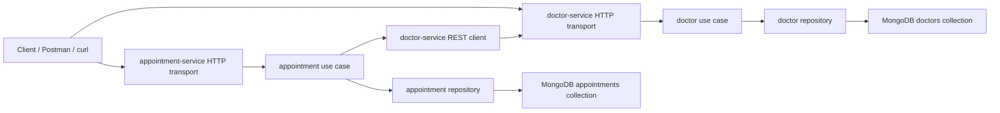

# Doctor Appointment System

Two HTTP microservices in Go:

- `doctor-service` owns doctor data
- `appointment-service` owns appointment data
- `appointment-service` validates doctor existence through REST, not through shared storage

The project stays in one repository and one Go module for coursework convenience, but each service now has its own runnable entrypoint:

- `go run ./cmd/doctor-service`
- `go run ./cmd/appointment-service`

For local convenience there is also a combined runner:

- `go run .`

## Project Overview And Purpose

This project models a small medical scheduling platform split into two bounded contexts:

- `doctor-service` manages doctor profiles
- `appointment-service` manages appointments

The goal of the assignment is not only to expose REST endpoints, but to demonstrate:

- clean separation between delivery, use case, repository, and wiring layers
- explicit service boundaries
- independent data ownership
- synchronous validation over HTTP instead of direct cross-service storage access

For a simple system like this, a monolith would be easier to deploy. The project is intentionally decomposed into two services to demonstrate Clean Architecture and microservice boundaries in a controlled scope.

## Architecture



## Why This Is A Microservice Decomposition

This is not just one codebase split into two handlers. The system has explicit service boundaries:

- each service exposes its own HTTP API
- each service owns its own repository implementation and data access logic
- `appointment-service` does not query doctor storage directly
- doctor existence is validated only through a REST call to `doctor-service`

The project is still submitted as one repository and one root `go.mod` because the assignment also requires `go run .`. Even with that packaging choice, the runtime boundary is still service-to-service over HTTP, which keeps the decomposition meaningful.

## Service Responsibilities

`doctor-service`

- creates doctors
- lists doctors
- gets doctor by id
- enforces required `full_name`
- enforces required valid `email`
- enforces unique email across all doctors

`appointment-service`

- creates appointments
- lists appointments
- gets appointment by id
- updates appointment status
- validates that `doctor_id` exists by calling `doctor-service`
- enforces appointment status rules

## Dependency Direction

The dependency flow is:

- `transport -> usecase -> repository/client`
- handlers depend on interfaces, not concrete use case structs
- domain models no longer contain HTTP JSON tags
- MongoDB document mapping stays inside repositories

This keeps HTTP concerns in transport and persistence concerns in repository code.

## Inter-Service Communication

`appointment-service` calls `doctor-service` before creating an appointment.

HTTP contract used for validation:

- request: `GET /doctors/:id`
- `200 OK`: doctor exists, appointment flow may continue
- `404 Not Found`: doctor does not exist, appointment creation is rejected
- `5xx` or network failure: appointment creation is rejected with `503 Service Unavailable`

The outbound call is implemented with:

- `http.NewRequestWithContext(...)`
- a dedicated HTTP client with a `3s` timeout
- response body closing with `defer response.Body.Close()`
- internal logging on failure

## Data Ownership

There is no shared doctor table read from `appointment-service`.

- `doctor-service` owns doctor records
- `appointment-service` stores only `doctor_id`
- doctor existence is checked through `GET /doctors/:id`

This makes the service boundary explicit and avoids hidden coupling through a shared database query.

## Why A Shared Database Was Not Used

A shared database would weaken the service boundary and turn the Appointment Service into a consumer of Doctor Service internals.

That would cause a few problems:

- repository-level coupling between bounded contexts
- hidden dependencies that bypass the Doctor Service API
- harder future changes to doctor storage schema
- a design closer to a distributed monolith than to service decomposition

By storing only `doctor_id` inside appointments and validating the doctor through REST, each service keeps ownership of its own data and rules.

## Failure Behavior

Doctor lookup from `appointment-service` uses:

- context-aware outbound requests
- a `3s` HTTP client timeout
- internal logging when doctor lookup fails
- `503 Service Unavailable` when `doctor-service` cannot be reached or returns `5xx`

Validation failures still return `400`, missing resources return `404`, and duplicate doctor emails return `409`.

## Production Resilience Trade-Offs

For this assignment, a timeout and explicit error handling are enough. A full retry strategy or circuit breaker would be unnecessary complexity for such a small system.

In a larger production system, these patterns would become useful when:

- temporary network issues cause short-lived outbound failures
- one service becomes slow and starts consuming worker threads in another service
- repeated failures need fast rejection instead of waiting on every call

Where they would fit:

- timeout policy: already at the outbound doctor-service client
- retry strategy: around transient network failures for safe idempotent reads such as `GET /doctors/:id`
- circuit breaker: around the doctor lookup client to avoid hammering an unhealthy downstream service

This assignment intentionally stops at timeout + descriptive failure handling + internal logging.

## Project Structure

```text
.
├── cmd
│   ├── appointment-service
│   └── doctor-service
├── internal
│   ├── appointment
│   │   ├── app
│   │   ├── client
│   │   ├── model
│   │   ├── repository
│   │   ├── transport/http
│   │   └── usecase
│   ├── doctor
│   │   ├── app
│   │   ├── model
│   │   ├── repository
│   │   ├── transport/http
│   │   └── usecase
│   └── platform
├── main.go
├── postman_collection.json
└── README.md
```

## Configuration

Supported environment variables:

```bash
MONGODB_URI=mongodb://localhost:27017
MONGODB_DATABASE=med_go
DOCTOR_SERVICE_ADDR=:8081
APPOINTMENT_SERVICE_ADDR=:8082
DOCTOR_SERVICE_BASE_URL=http://localhost:8081
```

The app reads `.env` automatically if present.

## Run Locally

Start MongoDB, for example:

```bash
docker run --name med-go-mongo -p 27017:27017 -d mongo:8
```

Run services separately:

```bash
go run ./cmd/doctor-service
go run ./cmd/appointment-service
```

Or run both from one process:

```bash
go run .
```

This root command exists because the assignment explicitly requires a runnable submission via `go run .`.

## Docker

Start the default stack:

```bash
docker compose up --build -d
```

This exposes:

- `127.0.0.1:8081` for `doctor-service`
- `127.0.0.1:8082` for `appointment-service`

Stop it:

```bash
docker compose down
```

Optional reverse proxy profile:

```bash
docker compose --profile proxy up --build -d
```

## API

A ready-to-import Postman collection is available in [postman_collection.json](/Users/myrzanizimbetov/Desktop/med-go/postman_collection.json).

### Doctor Service

`POST /doctors`

```json
{
  "full_name": "Dr. Alice Brown",
  "specialization": "Cardiology",
  "email": "alice.brown@example.com"
}
```

`specialization` is optional. `full_name` and `email` are required.

Example:

```bash
curl -s -X POST http://localhost:8081/doctors \
  -H 'Content-Type: application/json' \
  -d '{
    "full_name":"Dr. Alice Brown",
    "specialization":"Cardiology",
    "email":"alice.brown@example.com"
  }'
```

List doctors:

```bash
curl -s http://localhost:8081/doctors
```

Get doctor by id:

```bash
curl -s http://localhost:8081/doctors/<doctor_id>
```

### Appointment Service

`POST /appointments`

```json
{
  "title": "Initial Consultation",
  "description": "Review chest pain symptoms",
  "doctor_id": "<doctor_id>"
}
```

Example:

```bash
curl -s -X POST http://localhost:8082/appointments \
  -H 'Content-Type: application/json' \
  -d '{
    "title":"Initial Consultation",
    "description":"Review chest pain symptoms",
    "doctor_id":"<doctor_id>"
  }'
```

List appointments:

```bash
curl -s http://localhost:8082/appointments
```

Get appointment by id:

```bash
curl -s http://localhost:8082/appointments/<appointment_id>
```

Update status:

```bash
curl -s -X PATCH http://localhost:8082/appointments/<appointment_id>/status \
  -H 'Content-Type: application/json' \
  -d '{"status":"in_progress"}'
```

Supported statuses:

- `new`
- `in_progress`
- `done`

Forbidden transition:

- `done -> new`

## Observability

Start the observability profile:

```bash
docker compose --profile observability up --build -d
```

Available endpoints:

- Prometheus: `http://localhost:9090`
- Grafana: `http://localhost:3000`
- Doctor metrics: `http://localhost:8081/metrics`
- Appointment metrics: `http://localhost:8082/metrics`

## Notes

- if MongoDB is unavailable, startup fails fast
- doctor emails are normalized to lowercase before storing
- `doctor-service` creates a unique MongoDB index on `email`
