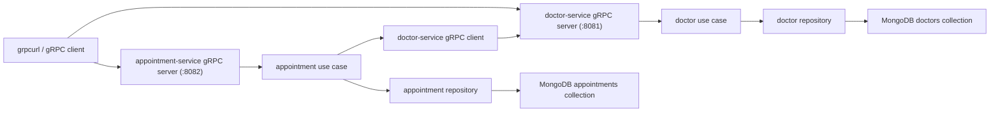

# Medical Scheduling Platform

Assignment 2 migrates the Medical Scheduling Platform from REST to gRPC while preserving the Clean Architecture layering and the bounded contexts from Assignment 1.

The system contains two services:

- `doctor-service` owns doctor profiles
- `appointment-service` owns appointments and validates doctors through the Doctor Service over gRPC

The repository stays runnable with `go run .`, as required by the assignment. The transport is now gRPC-only.

## Project Purpose

The purpose of the project is to demonstrate:

- Clean Architecture inside each service
- explicit microservice boundaries
- gRPC contract design with Protocol Buffers
- synchronous inter-service communication through gRPC
- correct propagation of gRPC status codes across service boundaries

The domain layer and business rules remain independent from protobuf-generated code. Only the delivery and client transport layers changed during the migration.

## Architecture



## Service Responsibilities And Data Ownership

`doctor-service`

- owns doctor profile data
- creates doctors
- lists doctors
- gets a doctor by id
- enforces required `full_name`
- enforces required valid `email`
- enforces unique email across all doctors

`appointment-service`

- owns appointment data
- creates appointments
- lists appointments
- gets an appointment by id
- updates appointment status
- validates doctor existence by calling `doctor-service` over gRPC before creating an appointment
- enforces status rules: `new`, `in_progress`, `done`, and forbids `done -> new`

Each service owns its own repository implementation. The Appointment Service never reads Doctor Service storage directly.

## Folder Structure And Dependency Flow

```text
.
├── cmd
│   ├── appointment-service
│   └── doctor-service
├── internal
│   ├── appointment
│   │   ├── app
│   │   ├── client
│   │   ├── model
│   │   ├── proto
│   │   ├── repository
│   │   ├── transport/grpc
│   │   └── usecase
│   ├── doctor
│   │   ├── app
│   │   ├── model
│   │   ├── proto
│   │   ├── repository
│   │   ├── transport/grpc
│   │   └── usecase
│   └── platform
├── scripts
│   └── generate_proto.sh
├── grpcurl_commands.md
├── main.go
└── README.md
```

Dependency direction:

- `transport/grpc -> usecase -> repository/client`
- `client -> generated doctor proto stub`
- domain models do not import protobuf-generated types
- use cases do not import protobuf-generated types
- mapping between proto messages and domain models happens only in the gRPC delivery layer

## Proto Contracts

Owned proto files:

- [internal/doctor/proto/doctor.proto](/Users/myrzanizimbetov/Desktop/med-go/internal/doctor/proto/doctor.proto)
- [internal/appointment/proto/appointment.proto](/Users/myrzanizimbetov/Desktop/med-go/internal/appointment/proto/appointment.proto)

Generated stubs committed to the repository:

- [internal/doctor/proto/doctor.pb.go](/Users/myrzanizimbetov/Desktop/med-go/internal/doctor/proto/doctor.pb.go)
- [internal/doctor/proto/doctor_grpc.pb.go](/Users/myrzanizimbetov/Desktop/med-go/internal/doctor/proto/doctor_grpc.pb.go)
- [internal/appointment/proto/appointment.pb.go](/Users/myrzanizimbetov/Desktop/med-go/internal/appointment/proto/appointment.pb.go)
- [internal/appointment/proto/appointment_grpc.pb.go](/Users/myrzanizimbetov/Desktop/med-go/internal/appointment/proto/appointment_grpc.pb.go)

### DoctorService RPCs

- `CreateDoctor(CreateDoctorRequest) returns (DoctorResponse)`
  Enforces required `full_name`, required valid `email`, and unique email.
- `GetDoctor(GetDoctorRequest) returns (DoctorResponse)`
  Returns `NOT_FOUND` when the doctor id does not exist.
- `ListDoctors(ListDoctorsRequest) returns (ListDoctorsResponse)`
  Returns all doctors.

### AppointmentService RPCs

- `CreateAppointment(CreateAppointmentRequest) returns (AppointmentResponse)`
  Enforces required `title`, required `doctor_id`, and validates doctor existence through `DoctorService.GetDoctor`.
- `GetAppointment(GetAppointmentRequest) returns (AppointmentResponse)`
  Returns `NOT_FOUND` when the appointment id does not exist.
- `ListAppointments(ListAppointmentsRequest) returns (ListAppointmentsResponse)`
  Returns all appointments.
- `UpdateAppointmentStatus(UpdateStatusRequest) returns (AppointmentResponse)`
  Enforces valid status values and rejects `done -> new`.

## Inter-Service Communication

`appointment-service` holds a gRPC client stub for the Doctor Service. That stub is hidden behind the `DoctorLookup` interface consumed by the appointment use case.

Flow for appointment creation:

1. The gRPC handler receives `CreateAppointmentRequest`.
2. The handler maps proto fields to `usecase.CreateAppointmentInput`.
3. The use case calls `DoctorLookup.Exists(ctx, doctorID)`.
4. The gRPC client calls `doctor.DoctorService/GetDoctor`.
5. The Appointment Service either continues or returns a gRPC error based on the result.

Remote result handling:

- Doctor Service returns `NOT_FOUND`: appointment creation returns `FAILED_PRECONDITION`
- Doctor Service is unreachable or times out: appointment creation returns `UNAVAILABLE`
- Doctor exists: appointment creation continues

## gRPC Error Handling Strategy

The project uses standard gRPC status codes from `google.golang.org/grpc/codes`.

| Situation | gRPC code |
| --- | --- |
| Required field missing | `InvalidArgument` |
| Email already in use | `AlreadyExists` |
| Doctor id not found in Doctor Service RPC | `NotFound` |
| Appointment id not found locally | `NotFound` |
| Doctor Service unreachable | `Unavailable` |
| Doctor does not exist during remote validation | `FailedPrecondition` |
| Invalid status or invalid status transition | `InvalidArgument` |

This mapping is implemented in the gRPC delivery layer, not inside the domain layer.

## Failure Scenario

If `doctor-service` is unavailable when `appointment-service` tries to validate `doctor_id`, the appointment must not be created.

Current behavior:

- the Appointment Service gRPC client uses a `3s` timeout
- the failure is logged internally
- the Appointment Service returns `codes.Unavailable` with a descriptive error

This preserves the rule that cross-service validation is mandatory and prevents creating inconsistent appointment data.

## Production Resilience Discussion

This assignment stops at timeout + explicit error propagation, but larger systems would usually add more resilience behavior around the outbound Doctor Service call.

Where each mechanism would fit:

- timeout: already implemented at the outbound gRPC client call
- retry: useful only for safe transient failures on idempotent reads such as `GetDoctor`
- circuit breaker: useful when repeated downstream failures should quickly short-circuit instead of consuming resources on every request

For this project, a full retry policy or circuit breaker would add complexity beyond the assignment scope.

## REST vs gRPC Trade-Offs

Three concrete differences:

1. Contract format
   REST commonly uses ad-hoc JSON payloads, while gRPC uses strongly typed `.proto` contracts and generated code.

2. Performance and payload shape
   REST with JSON is easier to inspect manually, while gRPC with Protocol Buffers is more compact and generally more efficient for service-to-service communication.

3. Error model
   REST usually communicates errors through HTTP status codes and JSON bodies, while gRPC has a standard application-level status model through `codes.Code`.

When to choose each:

- choose REST when public API accessibility, browser/debugger friendliness, and human-readable payloads matter most
- choose gRPC when internal service-to-service communication, strong contracts, and generated client/server stubs matter more

## Prerequisites

- Go 1.25+
- MongoDB running locally or available remotely
- `protoc`
- `protoc-gen-go`
- `protoc-gen-go-grpc`
- optional: `grpcurl` for manual testing

## Installing Protobuf And gRPC Tooling

Install `protoc`:

- macOS with Homebrew: `brew install protobuf`

Install Go plugins:

```bash
go install google.golang.org/protobuf/cmd/protoc-gen-go@v1.36.10
go install google.golang.org/grpc/cmd/protoc-gen-go-grpc@v1.5.1
```

Make sure `$(go env GOPATH)/bin` is on your `PATH`.

## Regenerating Proto Stubs

Run:

```bash
bash scripts/generate_proto.sh
```

This regenerates both services' `*.pb.go` and `*_grpc.pb.go` files from the committed `.proto` contracts.

## Configuration

Supported environment variables:

```bash
MONGODB_URI=mongodb://localhost:27017
MONGODB_DATABASE=med_go
DOCTOR_SERVICE_ADDR=:8081
APPOINTMENT_SERVICE_ADDR=:8082
DOCTOR_SERVICE_GRPC_TARGET=127.0.0.1:8081
```

The project reads `.env` automatically if present.

## How To Run Locally

1. Start MongoDB.

Example:

```bash
docker run --name med-go-mongo -p 27017:27017 -d mongo:8
```

2. Start `doctor-service`.

```bash
go run ./cmd/doctor-service
```

3. Start `appointment-service`.

```bash
go run ./cmd/appointment-service
```

Recommended startup order is Doctor Service first, then Appointment Service.

You can also start both services from one process:

```bash
go run .
```

The root command starts:

- `doctor-service` on `:8081`
- `appointment-service` on `:8082`

## Testing Artifact

Manual RPC examples are available in [grpcurl_commands.md](/Users/myrzanizimbetov/Desktop/med-go/grpcurl_commands.md).

These commands demonstrate:

- all doctor RPCs
- all appointment RPCs
- the exact method names and request shapes expected by the gRPC services

## Notes

- `go test ./...` passes
- domain models remain transport-agnostic
- use cases remain independent from protobuf-generated code
- generated protobuf stubs are committed so the project compiles without regeneration during grading
